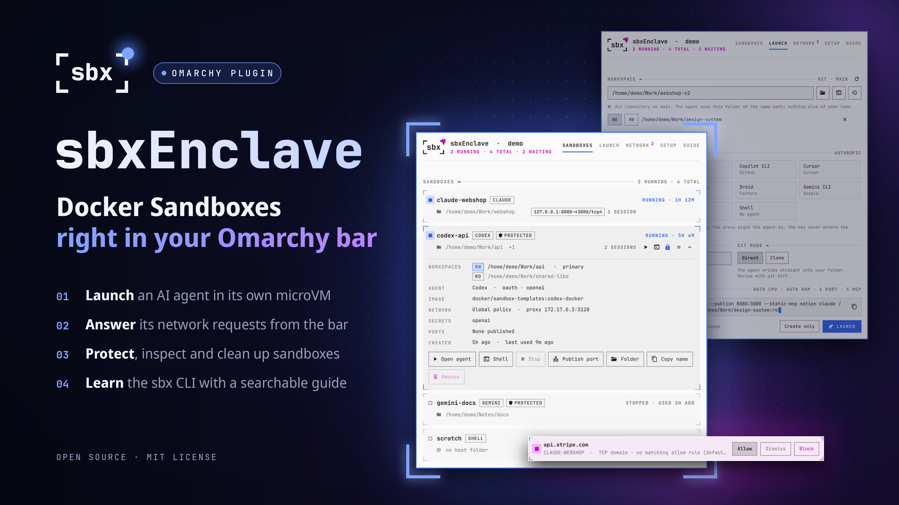
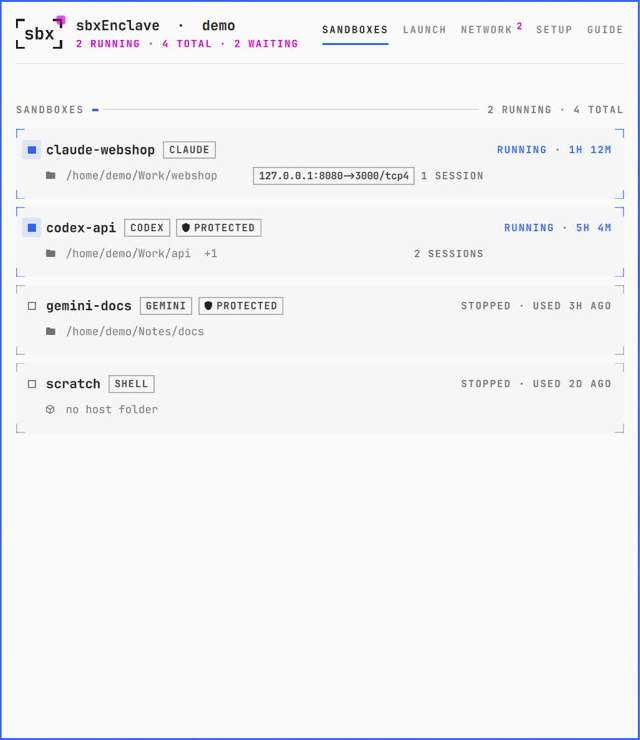
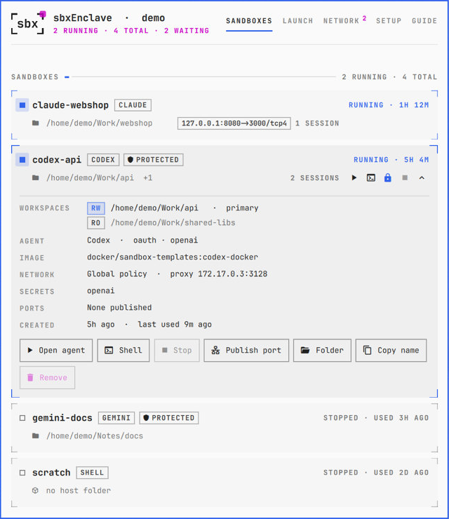
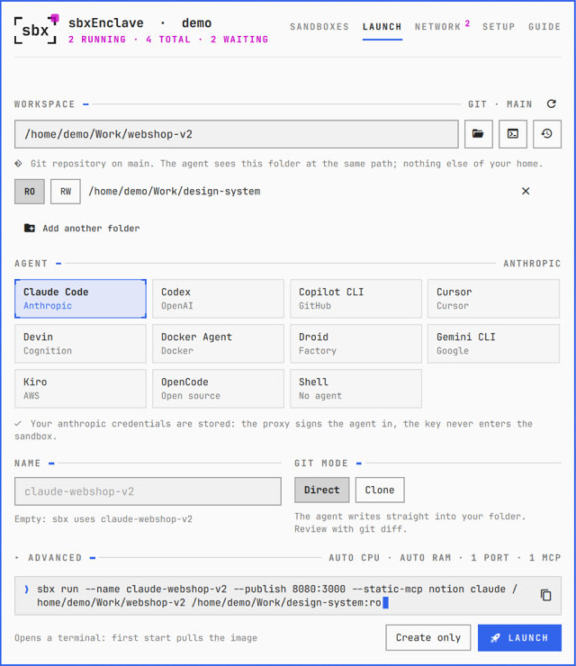
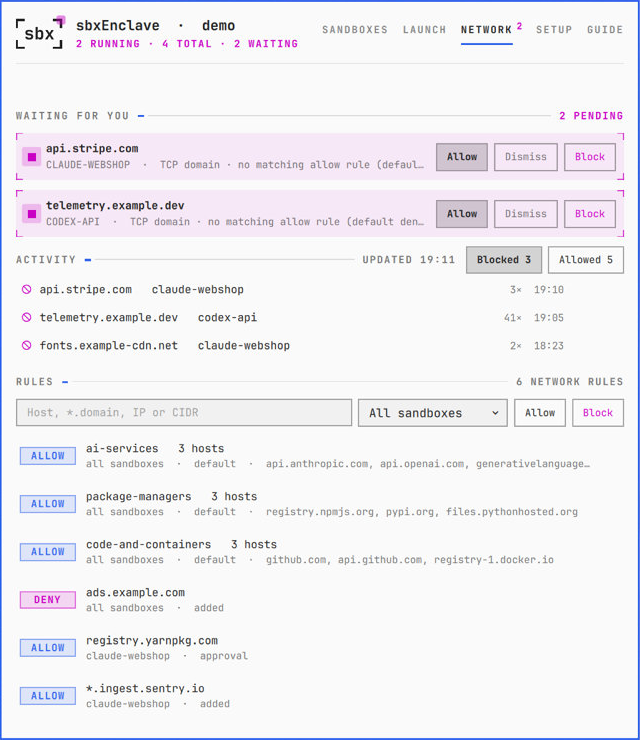
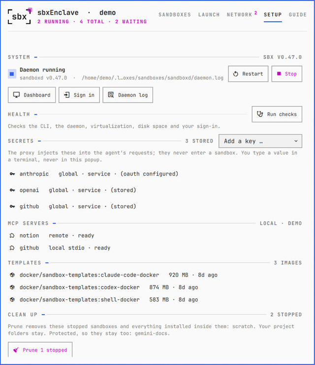
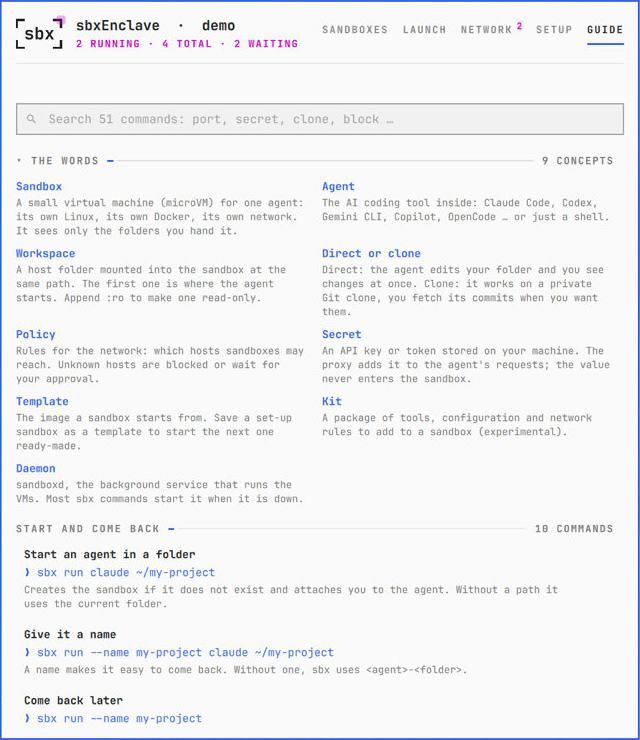

# sbxEnclave



**Docker Sandboxes in your Omarchy bar.** Start an AI coding agent in its own
microVM for any folder, keep an eye on what your sandboxes run and reach, and
answer their network requests without opening a terminal.

## Why Docker Sandboxes?

AI coding agents such as Claude Code, Codex or Gemini CLI get the most done when
they may act on their own: run commands, install packages and change files without
asking first. On your own machine that is a gamble, because the agent can do
everything you can. It can read your SSH keys and browser profiles, change files
outside the project, or send your code anywhere.

[Docker Sandboxes](https://docs.docker.com/ai/sandboxes/) (`sbx`) take that risk
away. Each agent runs in its own small virtual machine, a microVM with its own
Linux and its own Docker, and has full rights in there. But:

- **It sees only the folders you hand it.** Your home folder, your keys and your
  other projects stay outside. A folder you hand it directly is changed in place;
  in *clone* mode the agent works on a private Git clone instead, and you fetch its
  commits when you want them.
- **You decide what it can reach.** Every connection goes through a proxy on your
  machine. Hosts your policy allows pass; everything else is blocked or waits for
  your answer.
- **Your API keys stay outside.** Keys you store with `sbx secret set` are added to
  the agent's requests on the way out and never enter the sandbox.
- **A broken sandbox is easy to replace.** If an agent wrecks its environment,
  remove the sandbox and start a fresh one.

So the agent can work without stopping to ask about every command. `sbx` starts
Claude Code with `--dangerously-skip-permissions`, for example.

## Why sbxEnclave?

The `sbx` command line has dozens of commands and options, and an agent that wants
a new host waits until you answer it in a terminal. sbxEnclave keeps all of it one
click away:

- **The bar icon** shows how many sandboxes run and turns red when an agent waits
  for a network decision.
- **New sandboxes** start from a form with every option at hand, not from a command
  you have to remember.
- **Requests, rules, secrets, MCP servers, templates and the daemon** are in one
  popup, and a built-in guide explains the `sbx` commands as you go.

## Features

### Sandboxes

| Your sandboxes | Details and actions |
| --- | --- |
|  |  |

- **Every sandbox as a card:** status, agent, workspace folder, published ports and
  open sessions. Running sandboxes come first.
- **Quick actions:** open the agent, open a shell (a stopped sandbox is started
  first), stop, and unfold the card for its image, network policy, secrets and
  folders.
- **More actions:** publish a port, open the workspace folder, copy the name, and
  remove (two clicks).
- **Protect a sandbox** with the lock on its card: it can no longer be stopped,
  removed or pruned from sbxEnclave, and the daemon is not stopped or restarted
  while it runs. Unprotecting takes two clicks.
- Starting, stopping and removing show their progress on the card.

### Launch



- **Pick the folder** by typing, with the folder chooser, from the focused terminal,
  or from the workspaces of your sandboxes.
- **Pick the agent:** Claude Code, Codex, Copilot CLI, Cursor, Devin, Docker Agent,
  Droid, Gemini CLI, Kiro, OpenCode, or a plain shell.
- **Name and Git mode:** work on the folder directly, or on a private clone whose
  commits you fetch with `git fetch sandbox-<name>`.
- **More folders**, read-only unless you switch them to read-write.
- **Advanced:** CPUs, memory, published ports, environment variables, template,
  pull policy, skills, MCP servers, hosts to block, and kits.
- **The exact command** is shown below the form and can be copied. *Launch* opens
  it in a terminal; *Create only* creates the sandbox in the background, shows each
  step, and stops it again until you first use it.

### Network



- **Waiting for you:** when an agent asks for a host your policy does not allow, the
  request shows up here and the bar icon lights up. Answer with *Allow* or
  *Dismiss*, or *Block* the host for the sandbox that asked.
- **Activity:** the hosts your sandboxes reached or were refused, with counts.
- **Rules:** add an allow or deny rule for all sandboxes or one, and remove rules
  (two clicks). Rules you added or approved are listed by their hosts, not by the
  IDs `sbx` gives them.

### Setup and Guide

| Setup | Guide |
| --- | --- |
|  |  |

- **Setup:** versions, daemon start, restart and stop, the `sbx` dashboard, sign-in,
  the daemon log, health checks, stored secrets (names only), MCP servers,
  templates, and *Clean up*, which removes stopped sandboxes but never protected
  ones.
- **Guide:** the words you meet and 51 `sbx` commands grouped by task, searchable,
  each with a copy button.

### The bar icon

| Icon | Meaning |
| --- | --- |
| `sbx` in brackets | Docker Sandboxes is ready, nothing runs |
| with an accent light | sandboxes are running; from two on, the light shows how many |
| with a red light | a network request is waiting, the daemon does not answer, or a sandbox reports an error |
| dimmed | the daemon is stopped, you are not signed in to Docker, or `sbx` is not installed |

Left click opens the popup, middle click refreshes, and right click opens Launch,
or Network when a request is waiting.

## Requirements

- Omarchy with the Quickshell-based shell (Omarchy Quattro)
- [Docker Sandboxes](https://docs.docker.com/ai/sandboxes/install/) (`sbx`), signed in
  with `sbx login`. On Arch Linux, the AUR package `docker-sbx-bin` follows Docker's
  releases. Tested with `sbx` 0.47.0.

Everything else it uses ships with Omarchy: `curl`, `jq`, `timeout`, `setpriv`,
`flock`, `wl-copy`, `xdg-open`, `less`, and for the folder chooser `python-gobject`
and the desktop portal.

## Install

```sh
omarchy plugin add https://github.com/arikisonfire/omarchy-sbx-enclave.git --enable
```

The icon appears in the right section of the bar.

## Getting started

1. **Start a sandbox.** Right-click the `sbx` icon to open *Launch*. Pick the
   project folder and the agent, then click *Launch*. The agent opens in a
   terminal. The first start of an agent takes longer while `sbx` downloads its
   image.
2. **Come back to it.** Left-click the icon. Each sandbox is a card on
   *Sandboxes*: *Open agent* (`o`) brings the agent back, *Shell* (`s`) opens a
   shell inside, and *Stop* ends it when you are done.
3. **Answer the network.** When the icon turns red, an agent wants a host your
   policy does not allow. Right-click the icon to open *Network*: *Allow* lets
   that sandbox reach the host from now on, *Dismiss* keeps it blocked, and
   *Block* adds a deny rule for the sandbox that asked.
4. **Protect the sandbox you rely on.** Click the lock on its card, or press `p`.
   sbxEnclave then never stops, removes or prunes it.
5. **Tidy up now and then.** *Setup → Clean up* removes stopped sandboxes and
   everything installed inside them. Your project folders and protected sandboxes
   stay.

## Working on Omarchy itself

sbxEnclave manages sandboxes for any project. If you want an agent to tweak your
Omarchy setup or build plugins and apps from inside a sandbox, it needs your
Omarchy folders and a few actions outside the VM: restarting the shell, reading
its log, taking screenshots, starting a test app on your desktop.
[omarchy-sbx-setup](https://github.com/arikisonfire/omarchy-sbx-setup) sets that
up: it mounts exactly `~/.config/omarchy`, `~/.config/hypr` and
`/usr/share/omarchy` (read-only), and adds a small host bridge with a fixed list
of those actions.

## Usage

| Key | In the popup |
| --- | --- |
| `1` … `5` | Sandboxes, Launch, Network, Setup, Guide |
| `↑` `↓` or `j` `k` | Move between sandboxes |
| `Enter` | Unfold or fold the selected sandbox |
| `o` / `s` | Open the agent / a shell in the selected sandbox |
| `p` | Protect or unprotect the selected sandbox |
| `r` | Refresh |
| `n` | New sandbox (Launch) |
| `/` | Search the guide |
| `Esc` | Leave a text field, or close the popup |

Everything that cannot be undone, such as Remove, Prune, removing a rule or
stopping the daemon, takes a second click within five seconds.

## Configuration

The settings live on the widget's entry in `~/.config/omarchy/shell.json`:

```json
{
  "id": "io.github.arikisonfire.sbx-enclave",
  "refreshSeconds": 15,
  "protectedSandboxes": "my-project, scratch"
}
```

| Key | Meaning |
| --- | --- |
| `refreshSeconds` | How often the bar icon checks the daemon while the popup is closed, 5 to 300 seconds (default 15) |
| `protectedSandboxes` | Sandboxes that sbxEnclave never stops, removes or prunes, comma separated. The lock on a card edits this list. |

## Commands

```sh
omarchy-shell io.github.arikisonfire.sbx-enclave toggle            # open or close the popup
omarchy-shell io.github.arikisonfire.sbx-enclave show network      # sandboxes | launch | network | setup | guide
omarchy-shell io.github.arikisonfire.sbx-enclave expand my-project # open with one sandbox unfolded
omarchy-shell io.github.arikisonfire.sbx-enclave status            # the tooltip text
omarchy-shell io.github.arikisonfire.sbx-enclave refresh
omarchy-shell io.github.arikisonfire.sbx-enclave demo on           # made-up sandboxes, for trying it out
```

For example, in `~/.config/hypr/bindings.lua`:

```lua
o.bind("SUPER + CTRL + G", "Sandboxes", "omarchy-shell io.github.arikisonfire.sbx-enclave toggle")
```

## Update

```sh
omarchy plugin update io.github.arikisonfire.sbx-enclave
```

## Uninstall

```sh
omarchy plugin remove io.github.arikisonfire.sbx-enclave
```

Your sandboxes, rules and secrets stay in Docker Sandboxes. sbxEnclave keeps no
files of its own; its settings leave with its entry in the bar.

## Security and privacy

- **Your sandboxes stay as they are.** sbxEnclave only runs `sbx` commands you
  click, never starts the daemon on its own, and asks a second time before anything
  that cannot be undone.
- **Requests come from the agent.** The host in a network request, and in the
  activity list, is whatever the agent tried to reach. `sbx` reads a rule as a comma
  separated list of patterns, so `example.com,**` would allow every host. One-click
  *Allow* and *Block* are offered only for a single plain host name; anything else is
  flagged, and you can still answer it with `sbx policy approval`.
- **No shell in between.** Commands run as argument lists. Where Omarchy's terminal
  helper needs a command line, every word is quoted. Names and hosts go after `--`
  wherever `sbx` takes them, so they cannot be read as options, and the Launch form
  takes only full paths and valid names.
- **Your workspace is not trusted.** An agent in direct mode can write to your
  folder, including `.git`. sbxEnclave reads only `.git/HEAD` to show the branch and
  never runs `git` there.
- **Secrets stay out of the popup.** It lists their names only. A key is typed into
  `sbx secret set` in a terminal, never into sbxEnclave.
- **Light on your keyring.** Every `sbx` call opens sessions with the Secret
  Service, and frequent calls have crashed `gnome-keyring-daemon`. So the bar icon
  reads the daemon's own socket instead: health and waiting requests every 15
  seconds (every 3 while the popup is open), the sandbox list once a minute (every
  10 seconds while the popup is open). The `sbx` command runs only for actions and
  for the data a tab shows, and those results are kept for a short while.
- **No usage reports from it.** sbxEnclave's own `sbx` calls set
  `SBX_NO_TELEMETRY=1`, Docker's documented switch. Commands it opens in a terminal
  use your own environment.
- **It writes one setting.** The lock changes `protectedSandboxes` in `shell.json`,
  with Omarchy's own `omarchy-shell-config` helper and the same file lock Omarchy
  uses.
- Every call has a timeout, and a call still running when the shell restarts is
  ended with it.

## How it works

- The bar icon and the Sandboxes list read `sandboxd`'s Unix socket
  (`/daemon/health`, `/sandbox`, `/user-prompts`). This API is not documented by
  Docker, so a future `sbx` release may change it; sbxEnclave then shows the error
  instead of guessing.
- Everything else goes through the `sbx` command line: `inspect`, `policy`, `secret`,
  `template`, `mcp`, `prune --dry-run`, `diagnose`, and the actions you click.
- Agent terminals open with the window class `org.omarchy.sbx.<agent>`, for
  example `org.omarchy.sbx.claude`, so window rules and window switchers can tell
  agents apart. Shells keep `org.omarchy.sbx`.
- *Prune* in sbxEnclave reads the dry run and the sandbox list afresh, asks with
  the exact names, and then removes them one by one with `sbx rm`, so a protected
  sandbox is never part of it.
- Demo mode (`demo on`) fills every tab with made-up sandboxes under `/home/demo`
  and runs nothing.

## License

[MIT](LICENSE)

Docker and Docker Sandboxes are trademarks of Docker, Inc. sbxEnclave is an
independent project and is not affiliated with or endorsed by Docker.
